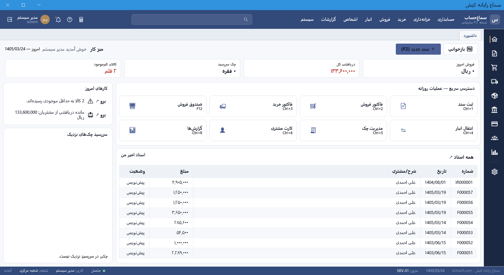
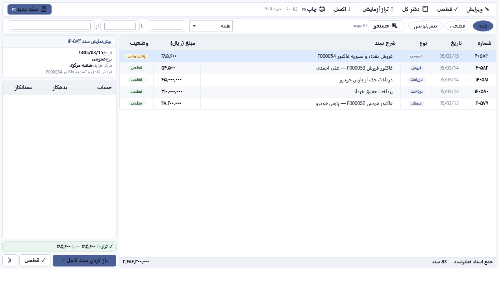
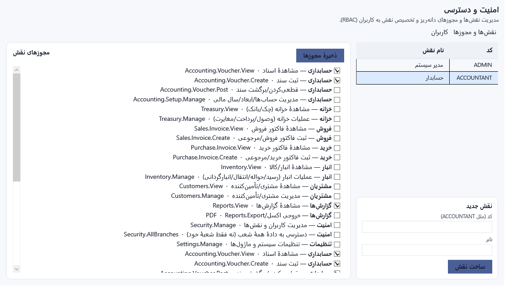
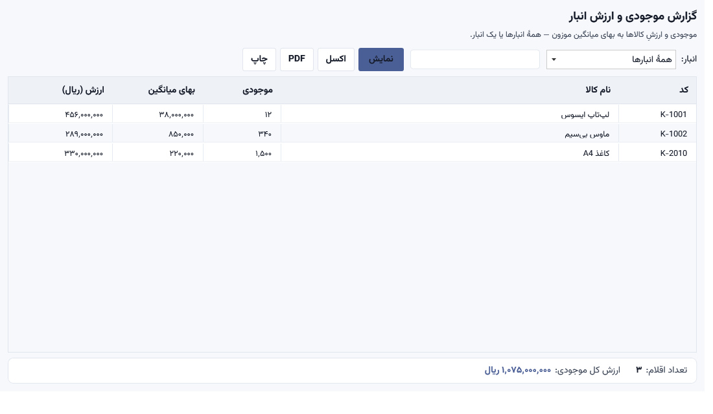
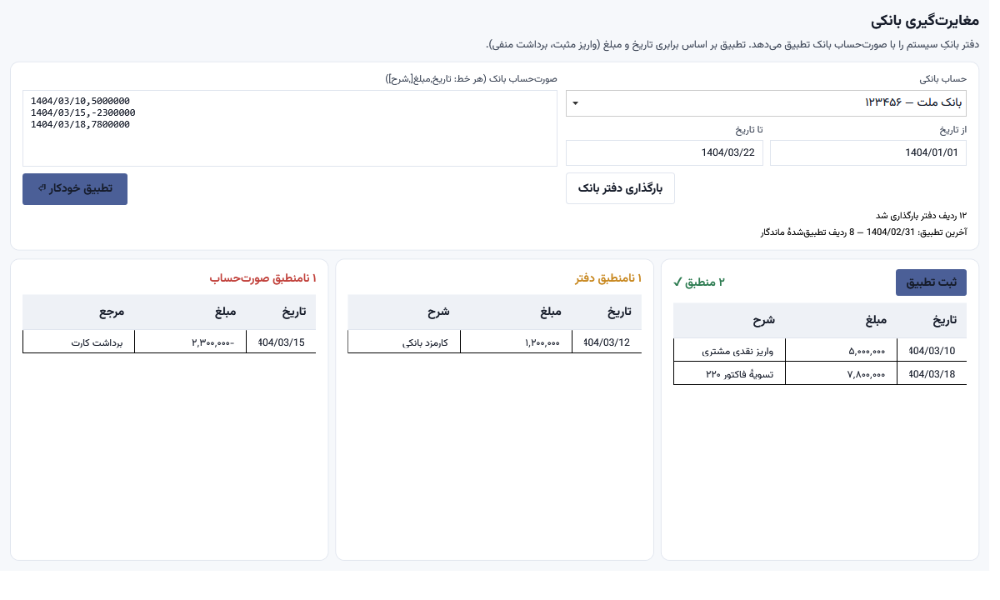
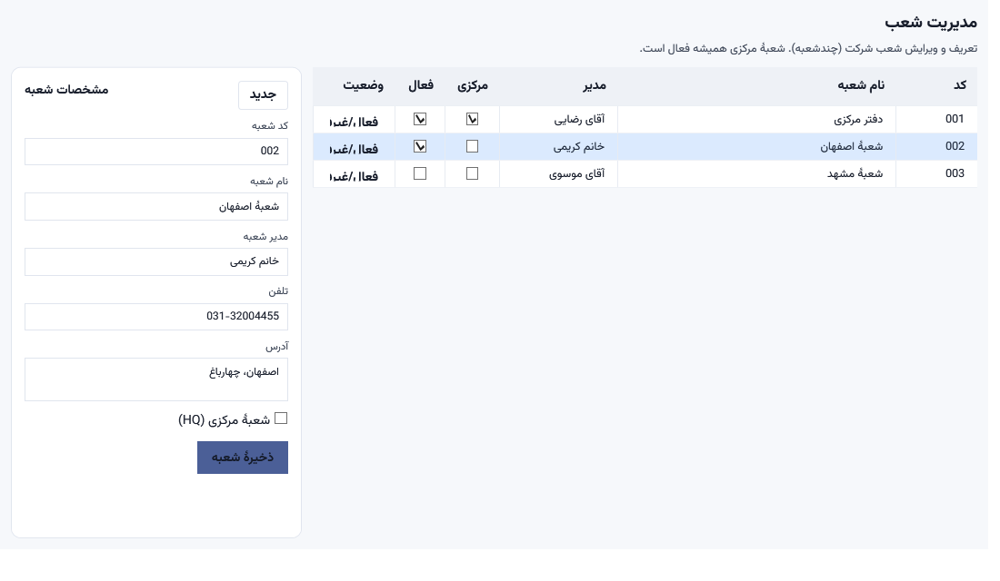

# سامانهٔ جامع «سما حساب» — نسخهٔ ۲.۴.۰

> یک نرم‌افزار **حسابداری و مدیریت کسب‌وکار (ERP)** کاملِ فارسی، راست‌به‌چپ، با تقویم شمسی — در سطحِ سپیدار/هلو/راهکاران (SMB).
> معماری مبتنی بر **سرور مرکزی (Web API)**: کلاینت‌ها از طریق شبکه به سرور وصل می‌شوند، نه مستقیم به پایگاه‌داده.

---

## ⬇️ دانلود (نسخهٔ ۲.۴.۰)

**نصابِ کاملِ خودکفا** (شاملِ .NET runtime — نیازی به پیش‌نیاز ندارد):

### 👉 [دانلودِ `SamaHesab_Setup_v2.4.0.exe` (~۱۰۸ مگابایت)](https://github.com/kish210/SamaHesab/releases/download/v2.4.0/SamaHesab_Setup_v2.4.0.exe)

> **تازه در ۲.۴.۰ (آمادگیِ تجاری):** گزارش‌های استانداردِ تازه — **ماندهٔ سنی‌شدهٔ دریافتنی/پرداختنی**، **خلاصهٔ مالیاتِ ارزش‌افزوده**، **دفترِ روزنامه** (همه با خروجیِ اکسل/PDF/چاپ) · **قفلِ دورهٔ مالیِ بسته** در همهٔ مسیرهای ثبت/تغییرِ سند · **کاملیِ حسابرسی** (تغییرِ وضعیتِ چک، سندِ دستی) · سیاستِ رمز · زمان‌بندِ خودکارِ بکاپ · اعتبارسنجیِ هویتِ مالیاتی.
>
> _نسخهٔ ۲.۳.۰:_ ساختِ خودکارِ پایگاه‌داده در اولین اجرا. _نسخهٔ ۲.۲.۰:_ PDFِ بومیِ فارسی + QR · سخت‌سازیِ مارکت‌پلیس · ویزاردِ راه‌اندازی + ورودِ اکسل · لایسنسِ RSA + Windows Service · صفحه‌بندیِ فهرست‌ها.

> همهٔ نسخه‌ها و فایل‌ها در صفحهٔ [Releases](https://github.com/kish210/SamaHesab/releases/latest).
> این نصاب کلاینتِ حسابداری + POS/رستوران + سرورِ API را با هم نصب می‌کند (مناسبِ نصبِ تک‌سیستمی). برای استقرارِ سرور/کلاینتِ جداگانه، بخشِ «نصب و راه‌اندازی» را ببینید.

---

## ✨ امکانات

### هستهٔ حسابداری
- **ثبت سند** کیبوردمحور (F2/F7/F8/F9 + `=` توازن خودکار)، با حساب‌های اخیر/موردعلاقه، ماندهٔ کنارِ هر حساب، الگو و کپیِ سند، و **عدم قطعی تا تراز شدن**.
- **اسناد حسابداری** با master-detail، فیلترِ بازه/نوع/وضعیت، پیمایشِ کیبوردی (↑↓/Enter)، و خروجیِ اکسل/چاپ.
- **نمودار حساب‌ها** درختی با جستجو، **ماندهٔ واقعی (با roll-up به والدها)**، ایجاد/ویرایش/حذفِ حساب و **drill-down مستقیم به دفتر کل**.
- گزارش‌های مالی: **تراز آزمایشی، دفتر کل/معین، سود و زیان، ترازنامه، صورت جریان وجوه نقد** — با فیلترِ شعبه/مرکزهزینه/پروژه و خروجیِ اکسل/PDF.
- مرکز هزینه، پروژه، سال مالی (با قفلِ دوره)، سند معکوس، و بستنِ سال مالی.

### خزانه‌داری
- **مدیریت چک** با کارت‌های آماری (در جریان/واگذار/وصول‌شده/برگشتی)، چرخهٔ وضعیت (وصول/واگذاری/برگشت با سند خودکار) و هشدارِ سررسید.
- صندوق/بانک، **مغایرت‌گیری بانکی**، دریافتنی/پرداختنی با تخصیص خودکار FIFO.
- **تسویهٔ بین‌شعبه** (انتقالِ وجه بین شعب با حساب جاریِ فی‌مابین و دو سندِ قطعیِ متوازن).

### فروش · خرید · انبار
- فاکتور فروش/خرید (فضای‌کاریِ کیبوردمحور + بارکد)، **مرجوعی فروش/خرید**، لیست‌قیمت و **تخفیفِ پلکانی**.
- مانده/صورت‌حسابِ مشتری و تأمین‌کننده، کنترلِ سقفِ اعتبار، باشگاه مشتریان.
- انبار: کاردکس، انتقال بین‌انبار، **انبارگردانی سندی**، بچ/سریال/انقضا، بهای تمام‌شدهٔ **میانگین موزون و FIFO**.

### امنیت · چندشعبه · داشبورد
- **نقش‌ها و مجوزهای دانه‌ریز (RBAC)** + JWT · چندشعبه با جداسازیِ داده · داشبورد نقش‌محور.

### ماژول‌های اختیاری
- صندوق فروشگاهی **POS** (لمسی، شیفت/Z-X، Hold/Recall) · **رستوران** (میز/گارسون/آشپزخانه) · CRM.

---

## 🖼 نمایی از محیط

| پوستهٔ اصلی | اسناد حسابداری |
|---|---|
|  |  |

| امنیت و دسترسی | گزارش موجودی انبار |
|---|---|
|  |  |

| مغایرت‌گیری بانکی | مدیریت شعب |
|---|---|
|  |  |

> تصاویرِ بیشتر (داشبورد، ثبت سند، چک، فاکتورها، POS و …) در پوشهٔ [`screenshot/`](screenshot/).

---

## 🚀 نصب و راه‌اندازی (کاربرِ نهایی)

نصاب‌های آمادهٔ نسخهٔ ۲ **خودکفا** هستند (به نصبِ جداگانهٔ .NET نیاز ندارند). تنها پیش‌نیازِ سرور، **SQL Server** است.

### ۱) سرور (یک‌بار، روی سیستمِ مرکزی)
1. **SQL Server 2019/2022** (Express یا بالاتر) را نصب کنید.
2. نصابِ سرور را اجرا کنید: **`SamaHesab_Server_Setup.exe`** — در ویزارد، نامِ سرورِ SQL (مثلاً `.\SQLEXPRESS`) و نامِ پایگاه‌داده (`SamaHesab`) را وارد کنید.
3. **نیازی به اجرای دستیِ اسکریپت نیست.** در اولین اجرا، برنامه خودش پایگاه‌داده (با نامِ واردشده) + schemaها + جدول‌ها + دادهٔ پایه (نمودار حساب‌ها، شرکت/شعبه/سالِ مالی، کاربرِ `admin`) را می‌سازد.
   > **مهاجرت‌ها خودکارند:** `DatabaseMigrator` در هر اجرا، نبودِ پایگاه‌داده/جدول‌های پایه را جبران و سپس مهاجرت‌های افزایشی (۱۱ به بعد) را idempotent اعمال و در `dbo.__AppliedScripts` ثبت می‌کند — پس پایگاه‌داده هیچ‌وقت از اسکیما عقب نمی‌مانَد. (اسکریپت‌های `database/` فقط برای مرجع همراه‌اند.)
4. سرویسِ Web API روی `http://<آی‌پی‌سرور>:5080` بالا می‌آید.

### ۲) کلاینت (روی هر سیستمِ کاربر)
1. نصابِ کلاینت را اجرا کنید: **`client.exe`**.
2. در ویزارد، **آدرس سرور** (`http://<آی‌پی‌سرور>:5080`) و **شناسهٔ شعبه** را وارد کنید.
3. برنامه را اجرا و وارد شوید.

> **یا** برای نصبِ تک‌سیستمی (سرور+کلاینت روی یک دستگاه): **`SamaHesab_Setup_v2.4.0.exe`**.

### ورودِ پیش‌فرض
```
نام کاربری: admin
گذرواژه:   admin123
```
> ⚠️ پس از نخستین ورود، گذرواژه و کلیدِ `Jwt:Key` در `appsettings.json`ِ سرور را تغییر دهید.

### حالت‌های اجرا
`SamaHesab.exe` (حسابداری) · `--pos` فروشگاه · `--restaurant` رستوران · `--waiter` گارسون · `--kitchen` آشپزخانه · `--warehouse` انبار.

📘 راهنمای کاملِ کاربر: [`docs/SamaHesab-UserGuide.pdf`](docs/SamaHesab-UserGuide.pdf)

---

## 🛠 ساخت از منبع (توسعه‌دهنده)

**پیش‌نیازها:** .NET 9 SDK · SQL Server · (برای ساختِ نصاب) Inno Setup 6.

```bash
# ۱) ساخت و تست
dotnet build SamaHesab.sln -c Release
dotnet test  tests/SamaHesab.Tests            # ~۳۵۰ تست

# ۲) اجرای سرور API (روی 5080)
cd src/SamaHesab.API && dotnet run -c Release
# رشتهٔ اتصال در src/SamaHesab.API/appsettings.json تنظیم شود
```

### ساختِ نصاب‌ها
```bash
powershell -ExecutionPolicy Bypass -File installer/publish-all.ps1   # تولید dist/ خودکفا
ISCC installer\client.iss             # -> installer/Output/client.exe
ISCC installer\server.iss             # -> installer/Output/SamaHesab_Server_Setup.exe
ISCC installer\SamaHesab_Setup.iss    # -> installer/Output/SamaHesab_Setup_v2.4.0.exe
```

---

## 🧱 معماری و فناوری
- **.NET 9 / WPF** (دسکتاپ، RTL، فونت Vazirmatn) · **ASP.NET Core Web API** (JWT) · **EF Core / SQL Server**.
- **Clean Architecture** + **CQRS / MediatR**: هر عملیات = Command/Query در لایهٔ Application؛ کلاینت‌ها فقط از طریق API.
- ساختار: `Domain → Application → Infrastructure → API / WPF`. هر تغییرِ دامنه = تست در `tests/SamaHesab.Tests`.

---

## 📄 مجوز
© سما نرم‌افزار — همهٔ حقوق محفوظ است.
