# سامانهٔ جامع «سما حساب» — نسخهٔ ۲.۷.۶

> یک نرم‌افزار **حسابداری و مدیریت کسب‌وکار (ERP)** کاملِ فارسی، راست‌به‌چپ، با تقویم شمسی — در سطحِ سپیدار/هلو/راهکاران (SMB).
> معماری مبتنی بر **سرور مرکزی (Web API)**: کلاینت‌ها از طریق شبکه به سرور وصل می‌شوند، نه مستقیم به پایگاه‌داده.

---

## ⬇️ دانلود (نسخهٔ ۲.۷.۶)

**نصابِ کاملِ خودکفا** (شاملِ .NET runtime — نیازی به پیش‌نیاز ندارد):

### 👉 [دانلودِ آخرین نسخه (صفحهٔ Releases)](https://github.com/kish210/SamaHesab/releases/latest)

> فایل‌های هر release: نصابِ تک‌سیستمی `SamaHesab_Setup_v<نسخه>.exe` · نصابِ کلاینت `SamaHesab_Client_Setup_v<نسخه>.exe` · نصابِ سرور `SamaHesab_Server_Setup_v<نسخه>.exe` · بستهٔ ماژول‌های اختیاری (`*.mspkg` + `modules-catalog.json`).

> **تازه در ۲.۷.۶:** **ماهیتِ چندوجهیِ اشخاص** — یک شخص می‌تواند هم‌زمان خریدار/تأمین‌کننده/کارمند/فروشنده باشد (تیکِ چندگانه در فرمِ ویرایشِ شخص) · اعتبارسنجیِ نامِ معتبر در مسیرِ ویرایشِ مشتری (نه فقط ساخت) · **پورسانتِ فروشنده برای فروشِ برنامهٔ اقامتی** (itinerary) هنگامِ تأییدِ مهمان · صدورِ خودکارِ سند/دریافتنی هنگامِ تأییدِ مهمانِ برنامهٔ اقامتی · **چاپ بارکد** (تولیدِ Code128 + چاپِ تکی/تعدادی) · **انتقال/تعدیلِ سریعِ انبار** (فرمِ تک‌ضربه) · «خدماتِ جدید» (کالای نوعِ خدمت) · منویِ کاملِ هر ماژول در نوارِ کناری با لینکِ اجرای کلاینتِ مستقل (صندوق/رستوران/گارسون/آشپزخانه) · بازچینشِ ناوبری (منوهای اصلی بالا، ماژول‌ها در نوارِ کناری، بدونِ تکرار) + کارت‌حساب اشخاص با کلیک + میان‌برِ سراسریِ F2=«جدید».
>
> **تازه در ۲.۶.x:** یکپارچه‌سازیِ محصولاتِ گردشگری/اقامتی (یک محصول، چند نقش) · ورودِ لیستِ مسافر در فروشِ گردشگری (دسکتاپ + پنلِ وبِ فروشنده) · تعلیق/فراخوانِ فاکتور (Hold/Recall) · باشگاهِ مشتریان/امتیاز · بهای تمام‌شدهٔ FIFO + ردیابیِ بچ/سریال · ایستگاه‌های چاپِ رستوران (فیش‌پرینترِ چندگانه بر اساسِ دسته‌بندیِ غذا).
>
> **تازه در ۲.۵.۵–۲.۵.۷:** **معماریِ کاملِ API-only** (کلاینت فقط از Web API، بدونِ دسترسیِ مستقیمِ DB) · **طرف‌حسابِ یکپارچهٔ چندنقشه** (`Crm.Parties`) · **مرکزِ پشتیبانیِ مشتری** · پولیشِ چاپِ فاکتور/قالب‌ها.
>
> **تازه در ۲.۵.۰:** سخت‌سازیِ سرورِ Web API — بوت‌استرپِ خودکارِ پایگاه‌داده، endpointِ `/health`، **جداسازیِ امنیتیِ چندشعبه**، **به‌روزرسانیِ خودکار از GitHub**.
>
> **تازه در ۲.۴.۰ (آمادگیِ تجاری):** ماندهٔ سنی‌شده، خلاصهٔ مالیاتِ ارزش‌افزوده، دفترِ روزنامه، سود و زیانِ کالا، کالای راکد، تحلیلِ ABC، گردشِ موجودی · قفلِ دورهٔ مالیِ بسته · کاملیِ حسابرسی.
>
> _نسخهٔ ۲.۳.۰:_ ساختِ خودکارِ پایگاه‌داده در اولین اجرا. _نسخهٔ ۲.۲.۰:_ PDFِ بومیِ فارسی + QR · لایسنسِ RSA + Windows Service.

> همهٔ نسخه‌ها و فایل‌ها در صفحهٔ [Releases](https://github.com/kish210/SamaHesab/releases/latest).
> این نصاب کلاینتِ حسابداری + POS/رستوران + سرورِ API را با هم نصب می‌کند (مناسبِ نصبِ تک‌سیستمی). برای استقرارِ سرور/کلاینتِ جداگانه، بخشِ «نصب و راه‌اندازی» را ببینید.

---

## ✨ امکانات

### هستهٔ حسابداری
- **ثبت سند** کیبوردمحور (F2/F7/F8/F9 + `=` توازن خودکار)، با حساب‌های اخیر/موردعلاقه، ماندهٔ کنارِ هر حساب، الگو و کپیِ سند، و **عدم قطعی تا تراز شدن**.
- **اسناد حسابداری** با master-detail، فیلترِ بازه/نوع/وضعیت، پیمایشِ کیبوردی (↑↓/Enter)، و خروجیِ اکسل/چاپ.
- **نمودار حساب‌ها** درختی با جستجو، **ماندهٔ واقعی (با roll-up به والدها)**، ایجاد/ویرایش/حذفِ حساب و **drill-down مستقیم به دفتر کل**.
- گزارش‌های مالی: **تراز آزمایشی، دفتر کل/معین، سود و زیان، ترازنامه، صورت جریان وجوه نقد** — با فیلترِ شعبه/مرکزهزینه/پروژه و خروجیِ اکسل/PDF.
- مرکز هزینه، پروژه، سال مالی (با قفلِ دوره)، سند معکوس، و بستنِ سال مالی.

### خزانه‌داری
- **مدیریت چک** با کارت‌های آماری (در جریان/واگذار/وصول‌شده/برگشتی)، چرخهٔ وضعیت (وصول/واگذاری/برگشت با سند خودکار) و هشدارِ سررسید.
- صندوق/بانک، **مغایرت‌گیری بانکی**، دریافتنی/پرداختنی با تخصیص خودکار FIFO.
- **تسویهٔ بین‌شعبه** (انتقالِ وجه بین شعب با حساب جاریِ فی‌مابین و دو سندِ قطعیِ متوازن).

### فروش · خرید · انبار
- فاکتور فروش/خرید (فضای‌کاریِ کیبوردمحور + بارکد)، **مرجوعی فروش/خرید**، لیست‌قیمت و **تخفیفِ پلکانی**، **تعلیق/فراخوانِ فاکتور (Hold/Recall)**.
- مانده/صورت‌حسابِ مشتری و تأمین‌کننده، کنترلِ سقفِ اعتبار، **باشگاه مشتریان/امتیاز**.
- **اشخاصِ چندوجهی**: یک شخص هم‌زمان خریدار/تأمین‌کننده/کارمند/فروشنده — با تیکِ چندگانه در همان فرم.
- انبار: کاردکس، انتقال بین‌انبار، **انتقال/تعدیلِ سریع** (فرمِ تک‌ضربه)، **انبارگردانی سندی**، بچ/سریال/انقضا، بهای تمام‌شدهٔ **میانگین موزون و FIFO**.
- **چاپ بارکد** (تولیدِ Code128 + چاپِ تکی/تعدادی)، «خدماتِ جدید» (کالای نوعِ خدمت).

### امنیت · چندشعبه · داشبورد
- **نقش‌ها و مجوزهای دانه‌ریز (RBAC)** + JWT · چندشعبه با جداسازیِ داده · داشبورد نقش‌محور.

### ماژول‌های اختیاری (پلاگین‌پذیر — نصب/حذف بدونِ نیاز به rebuildِ هسته)
- صندوق فروشگاهی **POS** (لمسی، شیفت/Z-X، Hold/Recall) · **رستوران** (میز/گارسون/آشپزخانه، ایستگاه‌های چاپِ چندگانه) · **گردشگری** (فروش/ودیعه/پورسانت/برنامه‌ریزیِ اقامتی + پنلِ وبِ مهمان) · **پیمانکاری** (صورت‌وضعیت/کسورات) · **هتل (PMS)** · **حقوق و دستمزد/حضور و غیاب** · **CRM/باشگاهِ مشتریان** · **مرکزِ پشتیبانیِ مشتری** (گزارشِ باگ/تیکت/دانشنامه/عیب‌یابی/ریموت + پلاگینِ وردپرس).

---

## 🖼 نمایی از محیط

| میزِ کار / داشبورد | ثبتِ سند |
|---|---|
| 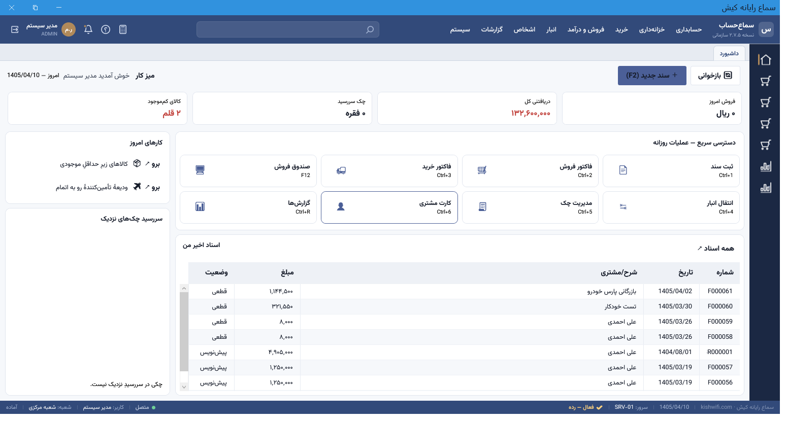 | 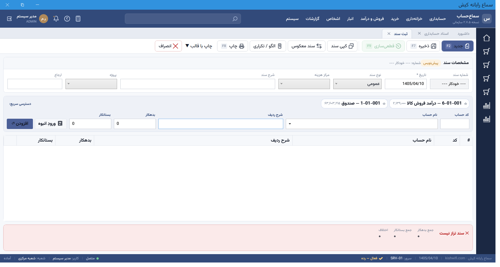 |

| نمودارِ حساب‌ها | مدیریتِ چک |
|---|---|
| 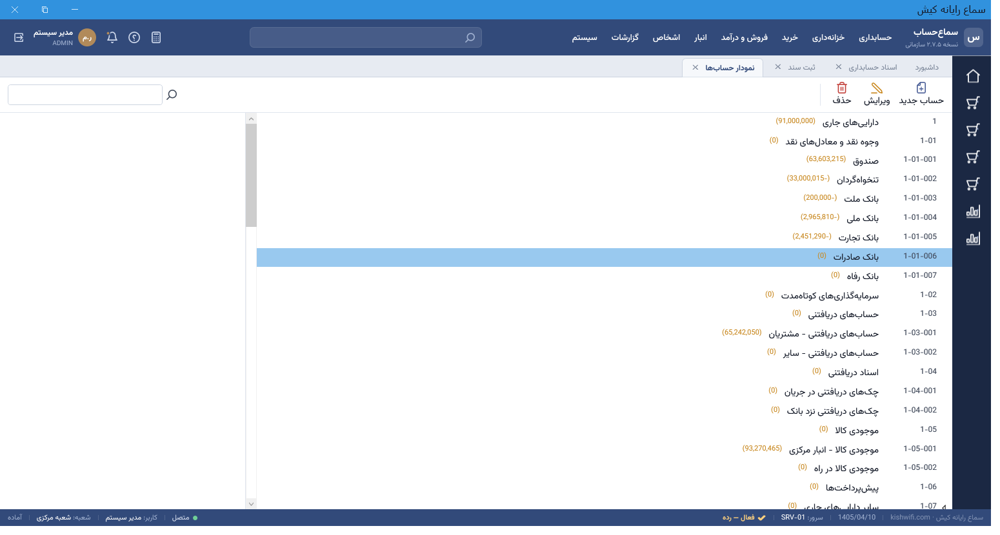 | 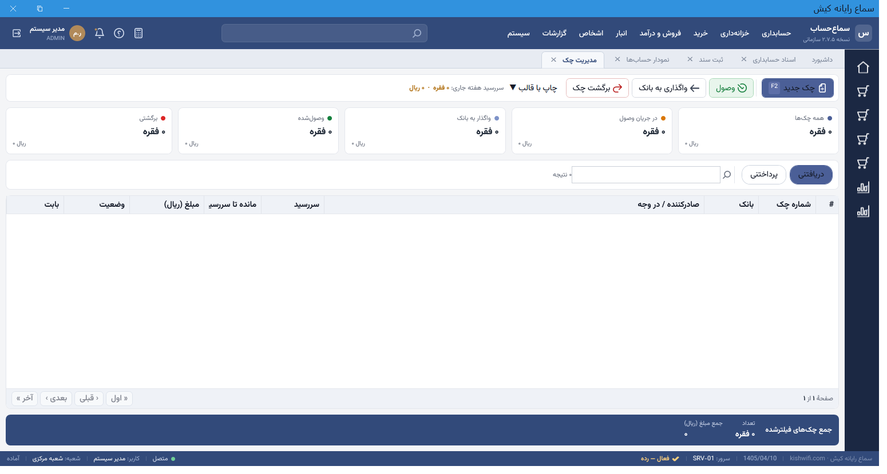 |

| فاکتورِ فروش | صندوقِ فروش (POS) |
|---|---|
| 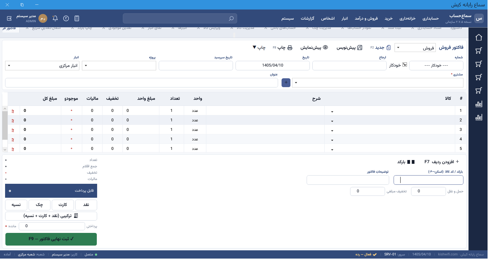 | 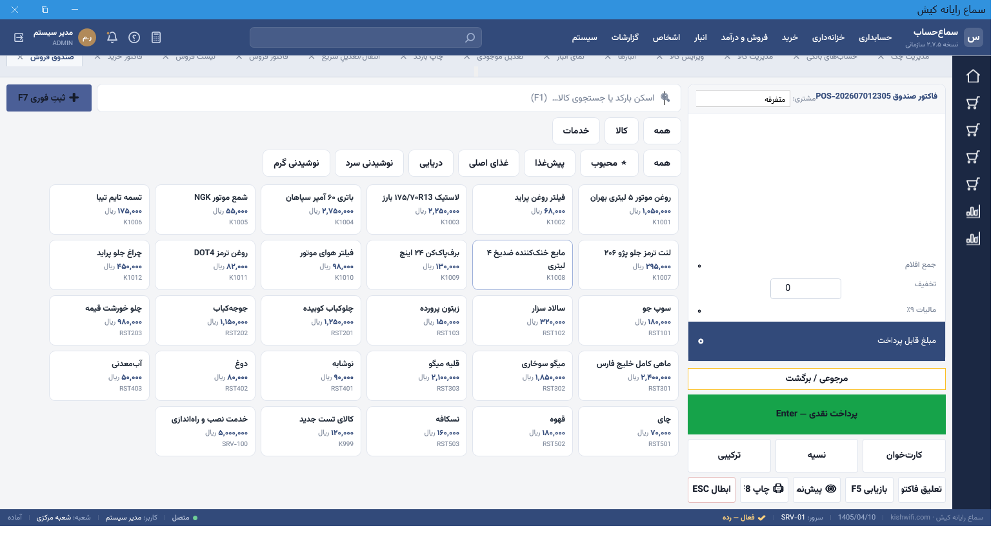 |

**🆕 اشخاصِ چندوجهی + بارکد + انتقال/تعدیلِ سریع (۲.۷.۶):**

| ویرایشِ شخص (چندوجهی: خریدار/تأمین‌کننده/کارمند/فروشنده) | چاپِ بارکد |
|---|---|
| 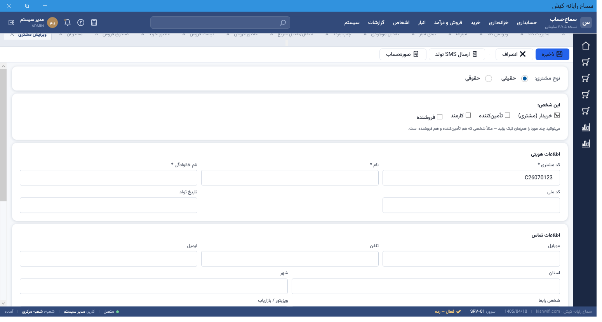 | 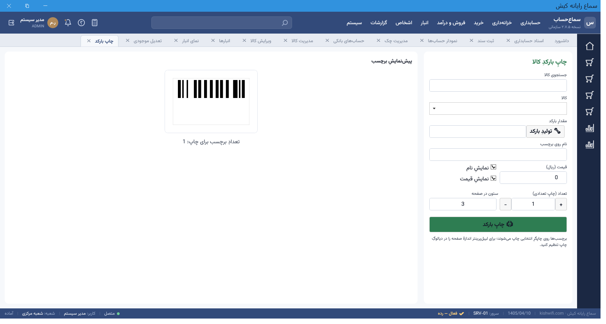 |

| انتقال/تعدیلِ سریعِ انبار | گردشگری — ثبتِ فروش |
|---|---|
| 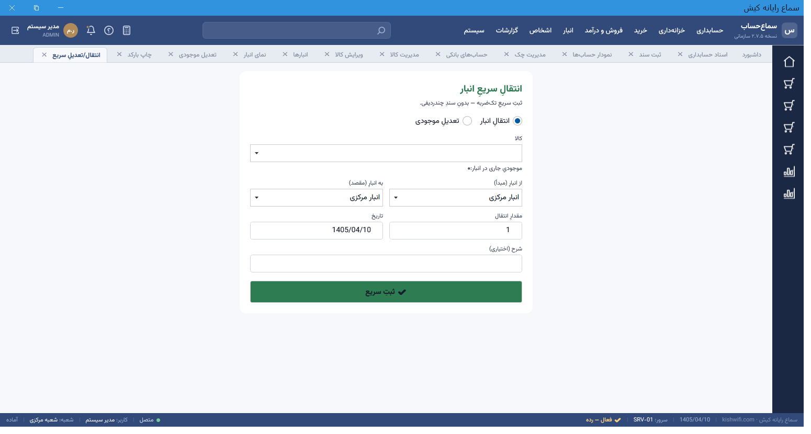 | 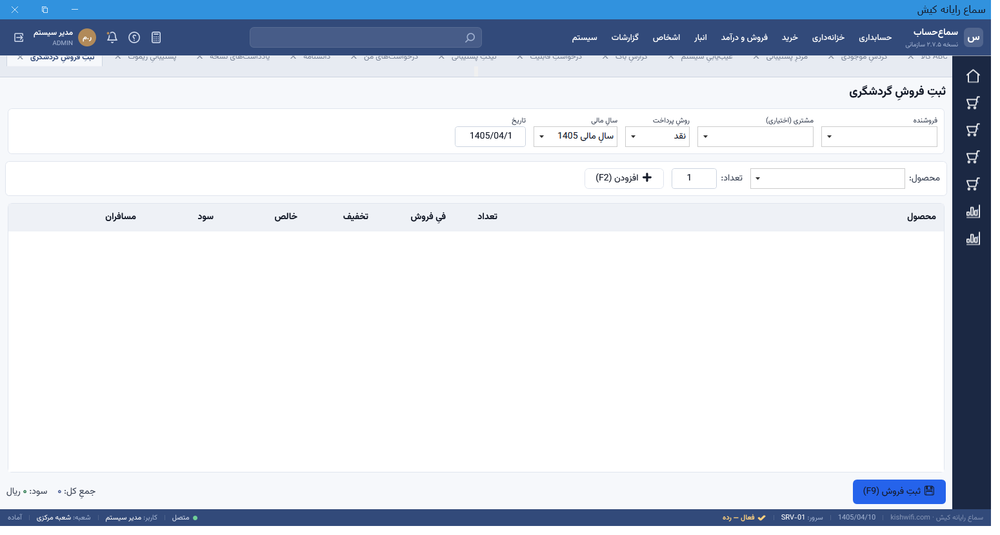 |

**گزارش‌های تجاری:**

| ماندهٔ سنی‌شده (دریافتنی/پرداختنی) | خلاصهٔ مالیات ارزش‌افزوده |
|---|---|
| 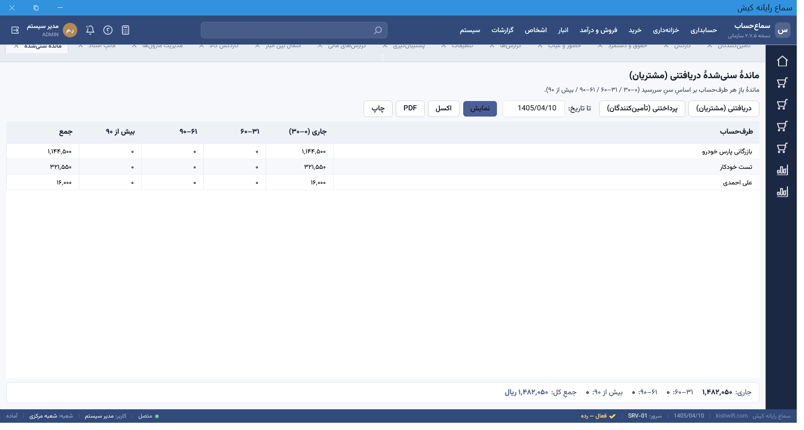 | 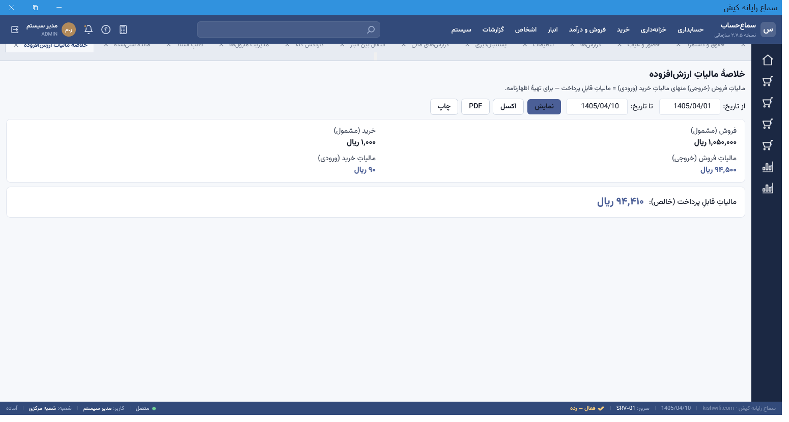 |

| کالای راکد / کم‌گردش | تحلیلِ ABC کالا |
|---|---|
| 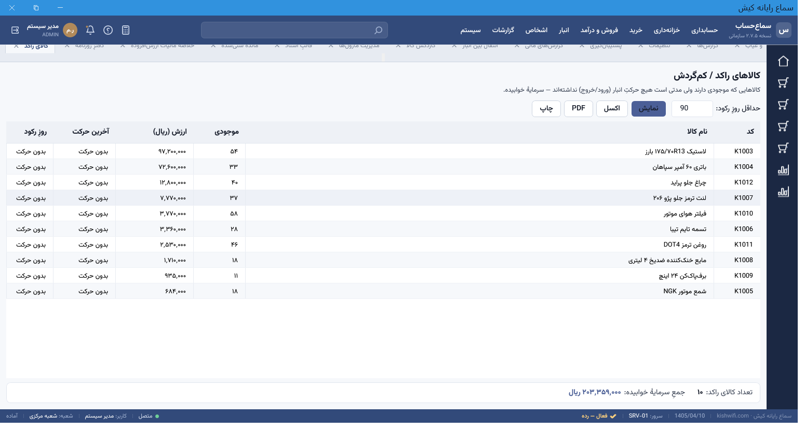 | 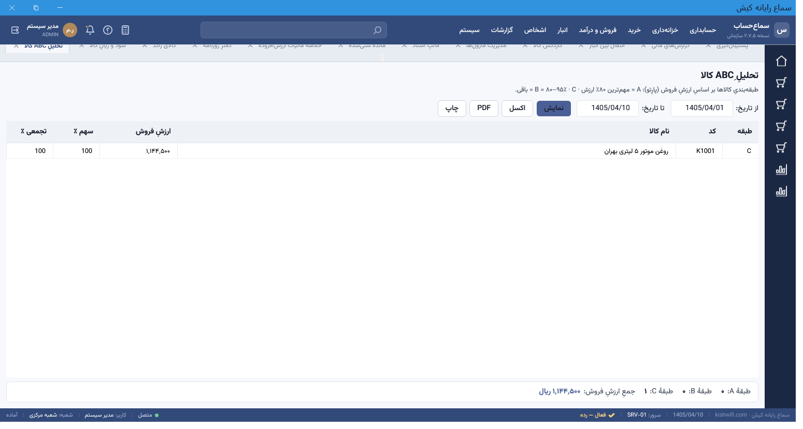 |

> تصاویرِ بیشتر (اسناد، انبار، خرید، مشتریان، پیمانکاری، پشتیبانی و …) در پوشهٔ [`screenshot/`](screenshot/) — بیش از ۵۰ صفحه، همگی از نسخهٔ در حالِ اجرا گرفته شده‌اند.

---

## 🚀 نصب و راه‌اندازی (کاربرِ نهایی)

نصاب‌های آمادهٔ نسخهٔ ۲ **خودکفا** هستند (به نصبِ جداگانهٔ .NET نیاز ندارند). تنها پیش‌نیازِ سرور، **SQL Server** است.

### ۱) سرور (یک‌بار، روی سیستمِ مرکزی)
1. **SQL Server 2019/2022** (Express یا بالاتر) را نصب کنید.
2. نصابِ سرور را اجرا کنید: **`SamaHesab_Server_Setup.exe`** — در ویزارد، نامِ سرورِ SQL (مثلاً `.\SQLEXPRESS`) و نامِ پایگاه‌داده (`SamaHesab`) را وارد کنید.
3. **نیازی به اجرای دستیِ اسکریپت نیست.** در اولین اجرا، برنامه خودش پایگاه‌داده (با نامِ واردشده) + schemaها + جدول‌ها + دادهٔ پایه (نمودار حساب‌ها، شرکت/شعبه/سالِ مالی، کاربرِ `admin`) را می‌سازد.
   > **مهاجرت‌ها خودکارند:** `DatabaseMigrator` در هر اجرا، نبودِ پایگاه‌داده/جدول‌های پایه را جبران و سپس مهاجرت‌های افزایشی (۱۱ به بعد) را idempotent اعمال و در `dbo.__AppliedScripts` ثبت می‌کند — پس پایگاه‌داده هیچ‌وقت از اسکیما عقب نمی‌مانَد. (اسکریپت‌های `database/` فقط برای مرجع همراه‌اند.)
4. سرویسِ Web API روی `http://<آی‌پی‌سرور>:5080` بالا می‌آید.

### ۲) کلاینت (روی هر سیستمِ کاربر)
1. نصابِ کلاینت را اجرا کنید: **`client.exe`**.
2. در ویزارد، **آدرس سرور** (`http://<آی‌پی‌سرور>:5080`) و **شناسهٔ شعبه** را وارد کنید.
3. برنامه را اجرا و وارد شوید.

> **یا** برای نصبِ تک‌سیستمی (سرور+کلاینت روی یک دستگاه): **`SamaHesab_Setup_v2.5.0.exe`**.

### ورودِ پیش‌فرض
```
نام کاربری: admin
گذرواژه:   admin123
```
> ⚠️ پس از نخستین ورود، گذرواژه و کلیدِ `Jwt:Key` در `appsettings.json`ِ سرور را تغییر دهید.

### حالت‌های اجرا
`SamaHesab.exe` (حسابداری) · `--pos` فروشگاه · `--restaurant` رستوران · `--waiter` گارسون · `--kitchen` آشپزخانه · `--warehouse` انبار.

📗 **خودآموزِ گام‌به‌گام (شروعِ سریع، تصویری):** [`docs/خودآموز.md`](docs/خودآموز.md) — از اولین اجرا تا گزارش‌ها. (نسخهٔ PDF: `docs/SamaHesab-Tutorial.pdf` — همراهِ نصاب نیز توزیع می‌شود.)
📘 راهنمای کاملِ کاربر: [`docs/SamaHesab-UserGuide.pdf`](docs/SamaHesab-UserGuide.pdf)

---

## 🛠 ساخت از منبع (توسعه‌دهنده)

**پیش‌نیازها:** .NET 9 SDK · SQL Server · (برای ساختِ نصاب) Inno Setup 6.

```bash
# ۱) ساخت و تست
dotnet build SamaHesab.sln -c Release
dotnet test  tests/SamaHesab.Tests            # ~۶۹۰ تست

# ۲) اجرای سرور API (روی 5080)
cd src/SamaHesab.API && dotnet run -c Release
# رشتهٔ اتصال در src/SamaHesab.API/appsettings.json تنظیم شود
```

### ساختِ نصاب‌ها
```bash
pwsh installer/publish-all.ps1        # تولید dist/ خودکفا (app + api)
ISCC installer\client.iss             # -> installer/Output/client.exe
ISCC installer\server.iss             # -> installer/Output/SamaHesab_Server_Setup.exe
ISCC installer\SamaHesab_Setup.iss    # -> installer/Output/SamaHesab_Setup_v<نسخه>.exe
pwsh installer/build-modules.ps1      # بستهٔ ماژول‌های اختیاری (.mspkg) + کاتالوگ
```

---

## 🧱 معماری و فناوری
- **.NET 9 / WPF** (دسکتاپ، RTL، فونت Vazirmatn) · **ASP.NET Core Web API** (JWT) · **EF Core / SQL Server**.
- **Clean Architecture** + **CQRS / MediatR**: هر عملیات = Command/Query در لایهٔ Application؛ کلاینت‌ها فقط از طریق API.
- ساختار: `Domain → Application → Infrastructure → API / WPF`. هر تغییرِ دامنه = تست در `tests/SamaHesab.Tests`.

---

## 📄 مجوز
© سما نرم‌افزار — همهٔ حقوق محفوظ است.
