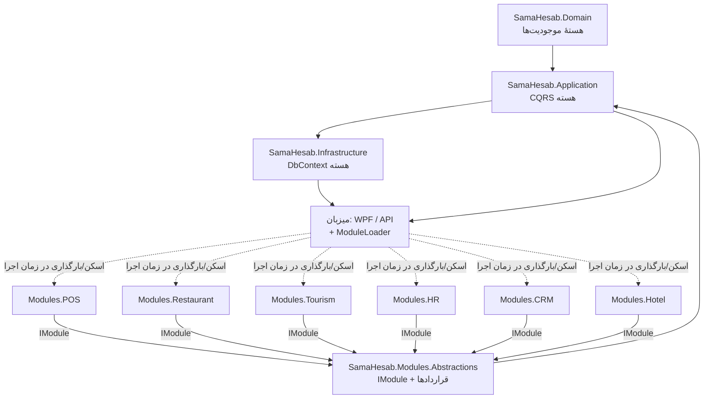

# SamaHesab — نقشهٔ ماژولارسازی (Monolith → Modular ERP Platform)

> سندِ تحلیل و مهاجرت (deliverables 1–5). **این یک بازنویسی نیست**؛ استخراجِ کنترل‌شده و غیرشکننده روی پایهٔ موجود.
> وضعیت: پیش‌نویسِ پیشنهادی — نیازمندِ تأییدِ کاربر و هماهنگی با C1 (pc) پیش از اجرای فاز ۱+.

---

## ۱) تحلیلِ معماریِ فعلی (واقعیتِ کد)

**لایه‌بندیِ مونولیت:**

```
Domain  ←  Application  ←  Infrastructure  ←  { API , WPF }
```

- `SamaHesab.Domain` — موجودیت‌ها (همهٔ دامنه‌ها، هسته‌ای و ماژولی، یک‌جا).
- `SamaHesab.Application` — CQRS/MediatR، موتورهای خالص (همهٔ دامنه‌ها).
- `SamaHesab.Infrastructure` — `ApplicationDbContext` (مپِ EFِ همهٔ موجودیت‌ها)، repositoryها.
- `SamaHesab.API` / `SamaHesab.WPF` — میزبان‌ها.
- پروژه‌های `POS/Restaurant/Kitchen/Waiter/Warehouse/Attendance` = **لانچرِ نازک** (`Process.Start("SamaHesab.exe","--pos")`) و **هیچ کدِ دامنه‌ای ندارند**.

**ردپای دامنه‌های ماژولی داخلِ ۴ پروژهٔ مونولیت (تعداد فایل، تقریبی):**

| دامنه | فایل | لِین |
|------|------|-----|
| POS | ~268 | C2 |
| HR/HRM/Payroll | ~186/63/22 | C1 (HR) |
| CRM | ~77 | C2 |
| Tourism | ~62 | C2 |
| Restaurant | ~40 | C2 |
| Contracting | ~30 | C2 |
| Attendance | ~30 | C1 |
| Hotel | ~15 | — |

**پایه‌های ماژولاریتی که از قبل وجود دارند (نقاطِ قوت):**

1. **جداسازیِ DB در سطحِ schema** — هسته: `Acc, Sal, Pur, Inv, Sec, Cfg`؛ ماژول‌ها: `Pos, Rst, Tur, Hrm, Crm, Htl, Con, Sup`. ⇒ شرطِ «جدولِ ماژول در schemaی خودش» تقریباً برآورده است.
2. **`ModuleService`** — تفکیکِ `CoreModules`/`OptionalModules` + `IsEnabled` + `Conflicts` + خروجی/ورودیِ پیکربندی. این **همان Module Manager** است.
3. **گیتِ ناوبری** — `MainViewModel._pageModule` + پرچم‌های `*Enabled`: منوها فقط با فعال‌بودنِ ماژول ظاهر می‌شوند.
4. **لانچرهای مجزا** — الگوی kiosk از قبل برای هر بخش هست.

**شکاف‌ها تا ماژولاریتیِ واقعی (آنچه نیست):**

| شکاف | توضیح |
|------|-------|
| G1 — جداسازیِ اسمبلی | کدِ ماژول‌ها فیزیکی داخلِ ۴ پروژهٔ مونولیت است؛ DLLِ ماژول قابلِ حذف نیست. |
| G2 — قراردادِ ماژول | هیچ `IModule` رسمی نیست که ماژول خودش منو/مجوز/گزارش/ویجت/سرویس را ثبت کند. |
| G3 — Module Loader | کشف/بارگذاریِ DLL وجود ندارد؛ همه compile‌-in است. |
| G4 — کوپلینگِ EF | `ApplicationDbContext` همهٔ موجودیت‌ها (هسته+ماژول) را مپ می‌کند؛ حذفِ ماژول نباید موجودیتش مپ شود. |
| G5 — مجوز/گزارش/لایسنسِ per-module | کاتالوگِ مجوز و گزارش‌ها یک‌جا تعریف شده‌اند؛ باید هر ماژول سهمِ خود را ثبت کند و با لایسنسِ جدا گیت شود. |

---

## ۲) دسته‌بندیِ هسته و ماژول

**Core (باید کوچک، پایدار، بازکاربردپذیر بماند):**
حسابداری · خزانه · انبار · فروش · خرید · اشخاص(پایه) · امنیت/مجوز/کاربر · چندشعبه · هستهٔ گزارش · موتورِ قالب · لایسنس · تنظیمات · لاگِ حسابرسی · زیرساختِ اعلان.
DB schemas: `Acc, Sal, Pur, Inv, Sec, Cfg` + بخشِ پایهٔ `Crm`(طرف‌حساب).

**Modules (اختیاری، قابلِ حذف):**
`POS (Pos)` · `Restaurant (Rst)` · `Tourism (Tur)` · `HR+Payroll+Attendance (Hrm)` · `CRM-loyalty (Crm)` · `Hotel (Htl)` · `Contracting (Con)` · `Support (Sup)`.

> یادداشت: «اشخاص/طرف‌حساب» هسته است (فروش/خرید لازمش دارند)؛ فقط «باشگاه مشتریان/امتیاز (CRM)» ماژول است.

---

## ۳) معماریِ هدف + دیاگرامِ وابستگی



قاعده: **ماژول‌ها فقط به `Modules.Abstractions` و Core وابسته‌اند؛ Core هرگز به ماژول وابسته نیست. میزبان ماژول‌ها را در زمانِ اجرا کشف می‌کند.**

---

## ۴) قراردادِ ماژول (Module Contract)

```csharp
// در SamaHesab.Modules.Abstractions (وابسته فقط به Abstractionهای DI/MediatR)
public interface IModule
{
    string Key { get; }            // مطابقِ ModuleService.Key (مثلِ "Restaurant")
    string DisplayName { get; }
    string Version { get; }

    void RegisterServices(IServiceCollection services);          // DI + MediatR assembly
    void RegisterEntities(ModelBuilder modelBuilder);            // مپِ EFِ موجودیت‌های ماژول (G4)
    IEnumerable<MenuContribution> GetMenus();                    // ناوبری
    IEnumerable<PermissionContribution> GetPermissions();        // کاتالوگِ مجوز
    IEnumerable<ReportContribution> GetReports();                // گزارش‌ها
    IEnumerable<DashboardWidget> GetDashboardWidgets();          // ویجت‌های داشبورد
    IEnumerable<string> GetMigrationScripts();                   // اسکریپت‌های schemaی ماژول
}
```

- ارتباطِ ماژول↔هسته فقط از طریقِ **اینترفیس‌های Core** (مثلِ `ICurrentUserService`, `IRepository<>`, `IMediator`) و **رویداد** (domain events) — بدونِ وابستگی به پیاده‌سازیِ ماژولِ دیگر.
- این قرارداد، شکاف‌های G2/G4/G5 را می‌بندد.

---

## ۵) Module Loader + Module Manager

**Loader (زمانِ استارت‌آپِ میزبان):**
1. اسکنِ پوشهٔ `modules/` برای `SamaHesab.Modules.*.dll`.
2. برای هر ماژولِ **نصب‌شده و فعال** (از `ModuleService` + وضعیتِ لایسنس):
   `RegisterServices` → `RegisterEntities` → ثبتِ منو/مجوز/گزارش/ویجت.
3. ماژولِ غیرفعال/حذف‌شده اصلاً بارگذاری نمی‌شود ⇒ منو/گزارش/مجوز/جدولش در دسترس نیست، **و هسته سالم می‌ماند**.

**Module Manager (توسعهٔ `ModuleService` فعلی):** نصب · فعال · غیرفعال · به‌روزرسانی · حذف · لایسنس — همه روی همان مدلِ `ModuleDef`.

---

## ۶) استراتژیِ دیتابیس / گزارش / ناوبری / لایسنس

- **DB:** جدول‌های هسته در schemaهای هسته؛ جدول‌های ماژول در schemaی خودش (از قبت جداست). نصبِ ماژول = اجرای `GetMigrationScripts()`؛ حذفِ ماژول = داده‌ها دست‌نخورده می‌مانند (بدونِ فساد)، یا با گزینهٔ صریحِ کاربر drop می‌شوند. **Core هرگز به schemaی ماژول JOIN نمی‌زند.**
- **گزارش:** گزارش‌های هسته در `SamaHesab.Reporting`؛ گزارش‌های ماژول از `GetReports()` ثبت می‌شوند.
- **ناوبری:** منوی هسته همیشه؛ منوی ماژول فقط با نصب+فعال‌بودن (الگوی موجودِ `_pageModule` رسمی می‌شود).
- **لایسنس:** هر ماژول کلیدِ لایسنسِ مستقل؛ Loader پیش از بارگذاری، وضعیتِ لایسنسِ ماژول را از `LicenseService` می‌پرسد. بسته‌ها: «فقط حسابداری»، «حسابداری+POS»، «حسابداری+رستوران»، …

---

## ۷) پلنِ مهاجرتِ فازبندی‌شده (غیرشکننده)

> اصل: در هر فاز، build سبز + ۵۳۹ تست سبز + **تستِ removability** (با غیرفعال‌کردنِ ماژول، هسته کار کند).

- **فاز ۰ — داربست (بدونِ جابه‌جاییِ کد):** پروژهٔ `SamaHesab.Modules.Abstractions` + `IModule` + `ModuleLoader` + توسعهٔ `ModuleService` به Manager. ماژول‌ها هنوز داخلِ مونولیت‌اند ولی پشتِ قرارداد ثبت می‌شوند. **ریسک: کم.**
- **فاز ۱ — پایلوت (کوچک‌ترین ماژول):** استخراجِ **Hotel** (~۱۵ فایل) به `SamaHesab.Modules.Hotel` با IModule کامل + جداسازیِ مپِ EF + تستِ removability. الگوی مرجع برای بقیه. **ریسک: متوسط.**
- **فاز ۲ — ماژول‌های C2:** Tourism → Contracting → Restaurant → POS (به‌ترتیبِ اندازه) — هرکدام یک PRِ مستقل.
- **فاز ۳ — ماژول‌های C1 (هماهنگی با pc):** HR/Payroll/Attendance، CRM.
- **فاز ۴ — سخت‌سازی:** Module Loaderِ DLL-scan واقعی + لایسنسِ per-module + نصاب per-module.

---

## ۸) ریسک‌ها و هماهنگی

- **pc فعال است** (هم‌اکنون روی گردشگری/هتل کامیت می‌زند). استخراجِ هم‌زمانِ یک فایل توسطِ دو ماشین = تعارض. ⇒ هر ماژول باید **claim در `todo.rm`** و **در یک PR/بازهٔ کوتاه** انجام شود؛ ماژول‌های لِینِ C1 (HR/CRM/Attendance) با هماهنگیِ pc.
- **کوپلینگِ EF (G4)** بزرگ‌ترین ریسکِ فنی است: `ApplicationDbContext` باید مدلِ ماژول را **شرطی** بسازد. راهکار: `IModelCustomizer`/فراخوانیِ `module.RegisterEntities` فقط برای ماژول‌های فعال؛ یا DbContextِ جدا per-module روی همان دیتابیس.
- **فیلترهای سراسری (multi-tenant/branch)** باید per-entity در همان ماژول تعریف شوند.
- **بدونِ بازنویسی:** کدِ منطقی جابه‌جا می‌شود نه بازنوشته؛ امضاها حفظ.

---

## ۹) توصیه

1. **اکنون فقط فاز ۰** (داربستِ قرارداد + Loader + Manager) — کم‌ریسک، چیزی نمی‌شکند، و seamها را آماده می‌کند.
2. سپس **فاز ۱ (پایلوتِ Hotel)** برای اثباتِ removability end-to-end.
3. بقیهٔ ماژول‌ها فاز‌به‌فاز با claim و هماهنگی با pc.

> پیش از شروعِ فاز ۱+، تأییدِ کاربر و توافق با pc لازم است (به‌خاطرِ مقیاس و تعارضِ هم‌زمان).
