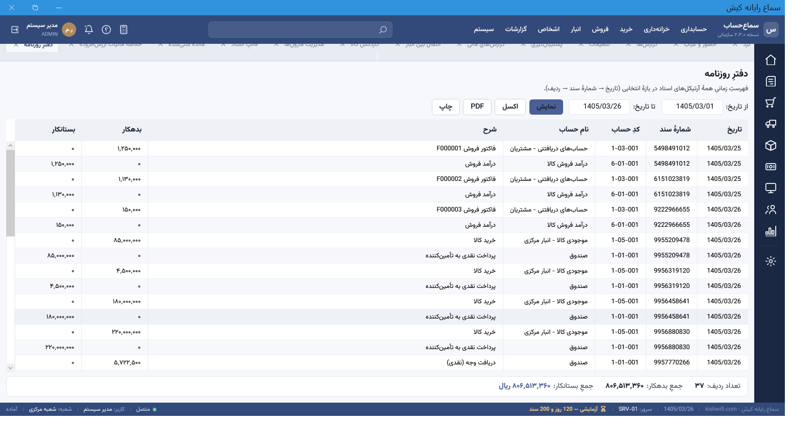
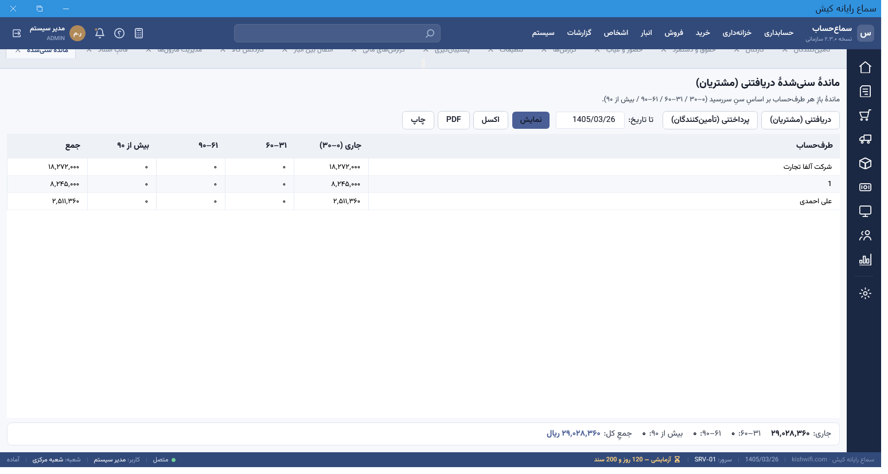
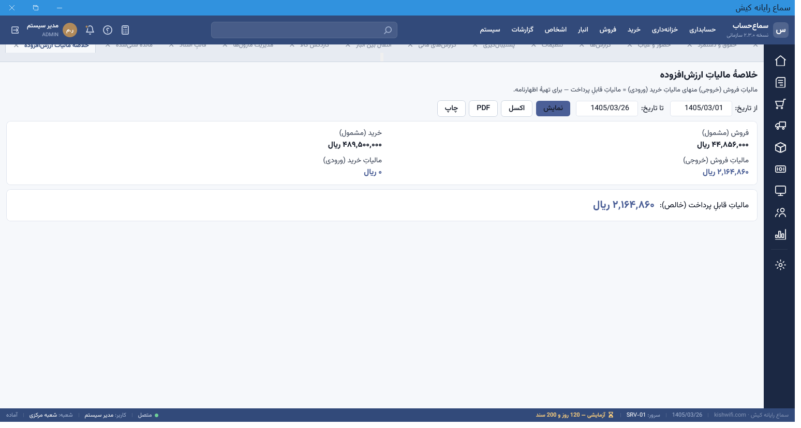

# 📘 خودآموزِ سما حساب — راهنمای گام‌به‌گامِ کاربر

> این خودآموز شما را از **اولین اجرا** تا **گرفتنِ گزارش‌های مالی** قدم‌به‌قدم همراهی می‌کند.
> برای مرجعِ کاملِ تک‌تکِ صفحات، به [`SamaHesab-UserGuide.pdf`](SamaHesab-UserGuide.pdf) مراجعه کنید.
>
> **مخاطب:** کاربرِ تازه‌کار (حسابدار/مدیرِ کسب‌وکار) که می‌خواهد در کمترین زمان کار با نرم‌افزار را یاد بگیرد.

---

## فهرست
1. [پیش از شروع](#۱-پیش-از-شروع)
2. [اولین اجرا و ورود](#۲-اولین-اجرا-و-ورود)
3. [آشنایی با محیط](#۳-آشنایی-با-محیط)
4. [راه‌اندازیِ اولیه (شرکت، سالِ مالی، رمز)](#۴-راهاندازیِ-اولیه)
5. [نمودارِ حساب‌ها](#۵-نمودارِ-حسابها)
6. [ثبتِ ماندهٔ افتتاحیه](#۶-ثبتِ-ماندهٔ-افتتاحیه)
7. [تعریفِ اشخاص (مشتری/تأمین‌کننده)](#۷-تعریفِ-اشخاص)
8. [تعریفِ کالا و انبار](#۸-تعریفِ-کالا-و-انبار)
9. [چرخهٔ خرید](#۹-چرخهٔ-خرید)
10. [چرخهٔ فروش](#۱۰-چرخهٔ-فروش)
11. [خزانه: دریافت، پرداخت و چک](#۱۱-خزانه)
12. [سندِ دستی و قطعی‌سازی](#۱۲-سندِ-دستی-و-قطعیسازی)
13. [گزارش‌ها](#۱۳-گزارشها)
14. [پشتیبان‌گیری و بستنِ سالِ مالی](#۱۴-پشتیبانگیری-و-بستنِ-سالِ-مالی)
15. [میان‌برهای کیبورد](#۱۵-میانبرهای-کیبورد)
16. [پرسش‌های پرتکرار و عیب‌یابی](#۱۶-پرسشهای-پرتکرار-و-عیبیابی)

---

## ۱) پیش از شروع
- نرم‌افزار را با نصابِ `SamaHesab_Setup_vX.Y.Z.exe` نصب کنید (شاملِ همه‌چیز است؛ به نصبِ جداگانهٔ .NET نیاز ندارید).
- تنها پیش‌نیاز روی سرور: **SQL Server** (Express هم کافی است).
- **پایگاه‌داده خودکار ساخته می‌شود** — در اولین اجرا، برنامه خودش جدول‌ها و داده‌های پایه را می‌سازد. نیازی به اجرای دستیِ هیچ اسکریپتی نیست.

## ۲) اولین اجرا و ورود
1. برنامه را اجرا کنید.
2. با کاربرِ پیش‌فرض وارد شوید:
   ```
   نام کاربری: admin
   گذرواژه:   admin123
   ```
3. ⚠️ در اولین ورود، نرم‌افزار از شما می‌خواهد **گذرواژه را عوض کنید** (سیاستِ امنیتی: حداقل ۸ نویسه شاملِ حرف و رقم). یک گذرواژهٔ قوی انتخاب کنید.

## ۳) آشنایی با محیط
نوارِ بالا منوهای اصلی (سیستم · حسابداری · خزانه‌داری · فروش · خرید · انبار · اشخاص · گزارشات) را دارد. هر صفحه در یک **تب** باز می‌شود و می‌توانید چند تب را هم‌زمان باز نگه دارید. پایینِ صفحه نوارِ وضعیت (کاربر/شعبه/تاریخ) و **وضعیتِ لایسنس** را نشان می‌دهد.


## ۴) راه‌اندازیِ اولیه
در اولین اجرا، **ویزاردِ راه‌اندازی** سه چیز را از شما می‌گیرد:
1. **مشخصاتِ شرکت** (نام، لوگو، کدِ اقتصادی/شناسهٔ ملی) — بعداً از *سیستم ← تنظیمات* قابلِ ویرایش است و روی سربرگِ چاپ‌ها می‌نشیند.
2. **سالِ مالی** (تاریخِ شروع/پایان، مثلاً `1404/01/01` تا `1404/12/29`).
3. **گذرواژهٔ مدیر**.

> اگر بعداً خواستید سالِ مالیِ جدید بسازید: *حسابداری ← ابعاد حسابداری ← سال مالی*.

## ۵) نمودارِ حساب‌ها
- مسیر: *حسابداری ← نمودار حساب‌ها*.
- یک **نمودارِ استانداردِ پیش‌فرض** از قبل ساخته شده (دارایی/بدهی/سرمایه/درآمد/هزینه).
- ساختار درختی است؛ روی هر شاخه می‌توانید **حسابِ معین/تفصیلی** اضافه کنید.
- ماندهٔ واقعیِ هر حساب (با جمعِ زیرشاخه‌ها) نمایش داده می‌شود و با دابل‌کلیک به **دفترِ کل** می‌روید.

## ۶) ثبتِ ماندهٔ افتتاحیه
اگر کسب‌وکارتان از قبل موجودی/مانده دارد، آن را به‌صورتِ **سندِ افتتاحیه** وارد کنید:
1. *حسابداری ← ثبت سند*.
2. نوعِ سند را **«افتتاحیه»** انتخاب کنید.
3. ردیف‌ها را وارد کنید (مثلاً بدهکار: صندوق ۵۰٬۰۰۰٬۰۰۰ و بانک ۲۰۰٬۰۰۰٬۰۰۰ / بستانکار: سرمایه ۲۵۰٬۰۰۰٬۰۰۰).
4. سند **تا متوازن‌نشدن (بدهکار=بستانکار) قطعی نمی‌شود** — تراز زنده پایینِ صفحه نشان داده می‌شود.

## ۷) تعریفِ اشخاص
- مسیر: *اشخاص ← مشتریان* یا *تأمین‌کنندگان*.
- «جدید» → نام، نوع (حقیقی/حقوقی)، تماس، و **هویتِ مالیاتی** (حقیقی: کدِ ملیِ ۱۰رقمی · حقوقی: شناسهٔ ملی + کدِ اقتصادی). نرم‌افزار صحتِ این کدها را **اعتبارسنجی** می‌کند.
- **سقفِ اعتبار** را می‌توانید تعیین کنید تا فروشِ نسیه فراتر از آن مسدود شود.

## ۸) تعریفِ کالا و انبار
1. *انبار ← کالاها ← جدید*: نام، کد، واحد، قیمتِ خرید/فروش، و روشِ ارزش‌گذاری (**میانگین** یا **FIFO**).
2. *انبار ← انبارها*: در صورتِ نیاز انبارهای متعدد بسازید.
3. موجودیِ اولیه را یا با **سندِ ورودِ انبار** یا هنگامِ خرید وارد کنید.

## ۹) چرخهٔ خرید
1. *خرید ← فاکتور خرید*.
2. تأمین‌کننده، انبار و ردیف‌های کالا (تعداد، قیمت، مالیات) را وارد کنید.
3. با ثبت: **موجودیِ انبار افزایش می‌یابد** و یک **سندِ حسابداریِ خودکار** (بدهکار: کالا/موجودی، بستانکار: حساب پرداختنی/صندوق) به‌صورتِ قطعی صادر می‌شود.

## ۱۰) چرخهٔ فروش
1. *فروش ← فاکتور فروش*.
2. مشتری، انبار و کالاها را وارد کنید؛ روشِ پرداخت را انتخاب کنید (**نقدی / بانک / چک / نسیه**).
3. با ثبت:
   - موجودیِ انبار **کاهش** می‌یابد (با بهای تمام‌شدهٔ میانگین/FIFO)،
   - **سندِ خودکار** صادر و قطعی می‌شود،
   - در فروشِ نسیه، **سقفِ اعتبارِ مشتری** کنترل می‌شود.


## ۱۱) خزانه
- **دریافت از مشتری:** *خزانه‌داری ← دریافتنی/پرداختنی* → روی مشتری «وصول» بزنید؛ مبلغ به‌صورتِ FIFO به فاکتورهای بازِ او تخصیص می‌یابد و سندِ خودکار می‌خورد.
- **پرداخت به تأمین‌کننده:** همان صفحه، سمتِ پرداختنی.
- **چک‌ها:** *حسابداری ← مدیریت چک* — چرخهٔ وضعیت (در جریان → وصول/واگذاری به بانک/برگشت)، هر تغییرِ وضعیت سندِ خودکار و **ردِّ حسابرسی** ثبت می‌کند؛ هشدارِ سررسید هم دارید.

## ۱۲) سندِ دستی و قطعی‌سازی
- *حسابداری ← ثبت سند*: ثبتِ کیبوردمحور (`F2` ردیفِ جدید، `=` توازنِ خودکار، `F7` ذخیره).
- سند ابتدا **پیش‌نویس** است؛ پس از بررسی **قطعی** می‌شود.
- **قفلِ دوره:** اگر سالِ مالی **بسته** باشد یا تاریخ خارج از بازهٔ آن باشد، ثبت/قطعی/برگشت **مجاز نیست** (پیامِ گویا می‌گیرید). سندِ قطعی‌شده ویرایش/حذف نمی‌شود؛ فقط با **سندِ برگشتی** خنثی می‌شود.

## ۱۳) گزارش‌ها
مسیر: منوی **گزارشات**.
- **تراز آزمایشی / دفتر کل و معین / سود و زیان / ترازنامه / صورت جریان وجوه نقد** — *گزارش‌های مالی* (با فیلترِ شعبه/مرکزهزینه/پروژه و خروجیِ اکسل/PDF).
- **دفترِ روزنامه:** فهرستِ زمانیِ همهٔ آرتیکل‌های اسناد.

  

- **ماندهٔ سنی‌شدهٔ دریافتنی/پرداختنی:** بدهیِ هر طرف‌حساب در سطل‌های ۰–۳۰ / ۳۱–۶۰ / ۶۱–۹۰ / بیش از ۹۰ روز.

  

- **خلاصهٔ مالیاتِ ارزش‌افزوده:** مالیاتِ فروش (خروجی) منهای خرید (ورودی) = مالیاتِ قابلِ پرداخت — برای تهیهٔ اظهارنامه.

  

- **اظهارِ حسابِ مشتری/تأمین‌کننده:** *اشخاص ← کارتِ مشتری* — ریزِ بدهکار/بستانکار با ماندهٔ متحرک.
- همهٔ گزارش‌ها خروجیِ **اکسل / PDF (فارسیِ راست‌چین) / چاپ** دارند.

## ۱۴) پشتیبان‌گیری و بستنِ سالِ مالی
- **پشتیبان:** *سیستم ← تنظیمات ← پشتیبان‌گیری* — تهیهٔ نسخهٔ پشتیبان و بازگردانی. می‌توانید **پشتیبانِ خودکارِ زمان‌بندی‌شده** را فعال کنید.
- **بستنِ سالِ مالی:** *حسابداری ← عملیات پایان دوره* — پس از اطمینان از صحتِ اسناد، سال را می‌بندید (سندِ اختتامیه). پس از بستن، ثبت در آن دوره قفل می‌شود.

## ۱۵) میان‌برهای کیبورد
| کلید | کار |
|---|---|
| `F2` | سند/ردیفِ جدید |
| `F7` | ذخیره |
| `=` | توازنِ خودکارِ سند |
| `Ctrl+1..6` | میان‌برهای دسترسیِ سریعِ داشبورد |
| `↑ ↓ / Enter` | پیمایشِ فهرست‌ها |

## ۱۶) پرسش‌های پرتکرار و عیب‌یابی
- **سند قطعی نمی‌شود؟** احتمالاً متوازن نیست (بدهکار ≠ بستانکار) یا تاریخش خارج از سالِ مالیِ باز است.
- **فروشِ نسیه رد می‌شود؟** سقفِ اعتبارِ مشتری پر شده — یا اعتبار را بالا ببرید یا با تأییدِ مجاز ادامه دهید.
- **«سال مالی بسته است»؟** برای ثبت در آن دوره باید سالِ مالیِ مناسب/باز را انتخاب کنید.
- **برنامه به سرور وصل نمی‌شود؟** آدرسِ سرور و در دسترس‌بودنِ SQL Server را بررسی کنید (*تنظیماتِ اتصال*).
- **گزارش خالی است؟** بازهٔ تاریخ و فیلترها را بررسی کنید و دکمهٔ «نمایش» را بزنید.

---

> 💡 **پیشنهادِ مسیرِ یادگیری:** ابتدا با **دادهٔ دمو** تمرین کنید (یک شرکتِ نمونه با کالا/مشتری/فاکتور)، سپس داده‌های واقعیِ خود را وارد کنید. برای پاک‌سازی و شروعِ تمیز، یک پایگاه‌دادهٔ تازه بسازید (برنامه خودش آن را می‌سازد).
